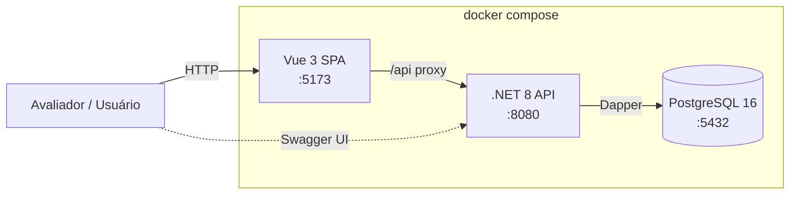
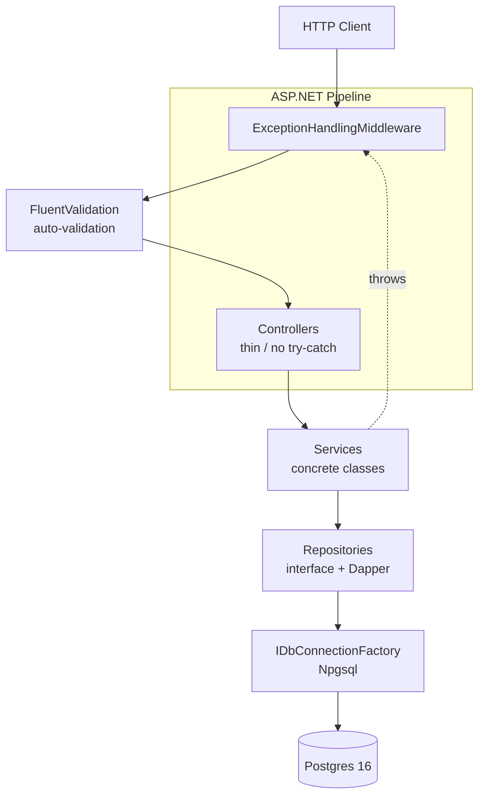
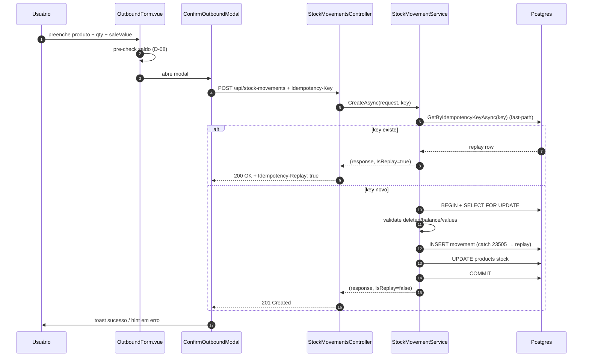
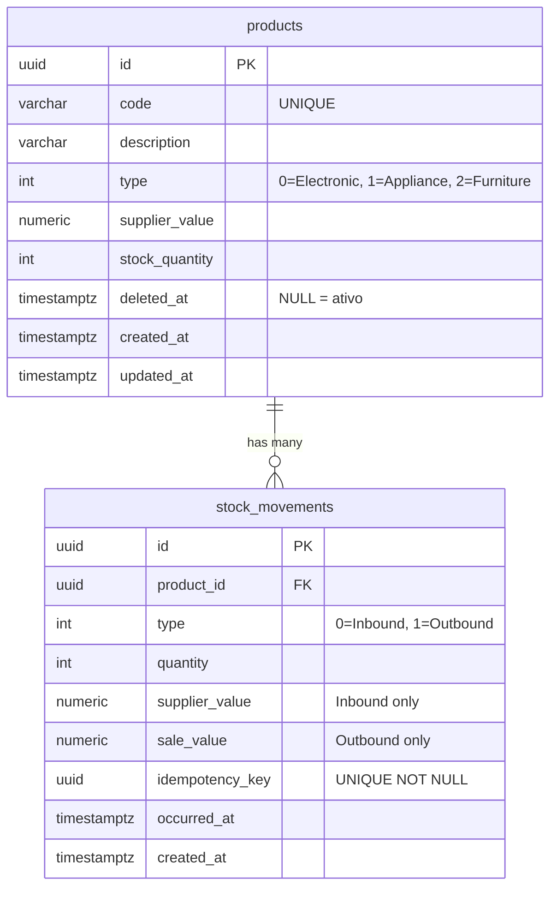
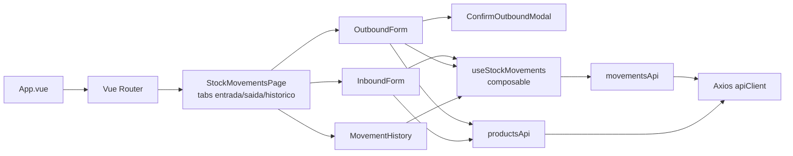

# StockEasy — Arquitetura

## Stack

| Camada | Tecnologia | Versão | Observação |
|--------|------------|--------|------------|
| Frontend | Vue 3 + Vite + TS strict + Tailwind | Vue 3.5, Vite 5 | Composables only (sem Pinia); feature-based em `src/features/{products,stock}/`. |
| Backend | ASP.NET Core Web API | .NET 8 LTS | Single-project N-tier (`backend/Inventory/`) + projeto irmão `Inventory.Tests/`. |
| ORM | Dapper | 2.x | SQL inline com aliases (`supplier_value AS SupplierValue`); sem migrations. |
| DB | PostgreSQL | 16-alpine | Schema canônico em `init.sql` (raiz do repo). |
| Validação | FluentValidation + Vee-Validate/Zod | — | Mensagens PT-BR espelhadas byte-a-byte (backend autoridade, frontend UX preventiva). |
| Containers | docker compose | — | 3 serviços (`postgres`, `backend`, `frontend`) com hot reload nos dois lados. |
| API docs | Swashbuckle + Annotations | — | Swagger UI em `/swagger`; `operationIds` estáveis camelCase. |
| Tests | xUnit + Moq + Vitest + @vue/test-utils | — | CI local (TEST-07) — `dotnet test` + `npm test` rodam green sem CI remoto. |

## Diagrama 1 — System Context

Visão de alto nível: avaliador interage com a SPA, que conversa com a API via proxy `/api` do Vite; a API persiste em Postgres. Tudo orquestrado por `docker compose`.



## Diagrama 2 — Backend Layered

Pipeline ASP.NET Core do StockEasy: o `ExceptionHandlingMiddleware` é o **primeiro** middleware registrado (single chokepoint para mapear `DomainException → ErrorResponse`). FluentValidation auto-validation roda antes do controller, que é thin e delega ao service concreto. Repositories são interface + impl Dapper. Exceções de service sobem direto até o middleware (controllers nunca fazem try/catch).



## Diagrama 3 — Sequence: Saída de Estoque (Outbound)

Fluxo end-to-end de um movimento Outbound, com idempotency fast-path (replay antes de abrir transação) e race-window recovery (catch de Postgres `SqlState 23505` no INSERT). O service abre transação só após o fast-path falhar, faz `SELECT ... FOR UPDATE` no produto (BACK-10), valida invariants, INSERT do movimento, UPDATE do produto e COMMIT — atômico.



## Diagrama 4 — ER Diagram

Schema canônico do `init.sql`: duas tabelas, uma relação 1-N (`products → stock_movements`). Observações chave: `products.code` é `UNIQUE` **sem filtro** de `deleted_at` (anti-reuso de código mesmo após soft delete — PROD-06 enforcement no banco); `stock_movements.idempotency_key` é `NOT NULL UNIQUE` (idempotency MOVE-02/03); `stock_movements` não tem `deleted_at` porque o histórico é imutável (MOVE-11).



## Diagrama 5 — Frontend Feature Flow (Stock Movements)

Como a feature `stock` se compõe internamente: `App.vue` → router → `StockMovementsPage` com tab strip (`entrada` / `saida` / `historico` via URL `?tab=`); cada tab monta um componente diferente; todos consomem o composable `useStockMovements`; mutações usam `movementsApi` (com Axios interceptor injetando `Idempotency-Key`), e os forms também consultam `productsApi` para o searchable dropdown.



## Como Executar

Pré-requisitos: `docker` + `docker compose`.

```bash
docker compose up
```

Na primeira execução, o `docker compose` constrói as imagens (.NET SDK e Node 20), sobe Postgres com `init.sql` aplicado automaticamente, e starta o backend em hot reload (`dotnet watch run`) + frontend em modo dev (`vite`). Em ~30-60s, três URLs ficam disponíveis:

| Serviço | URL |
|---------|-----|
| Frontend SPA (Vue) | <http://localhost:5173> |
| Backend Swagger UI | <http://localhost:8080/swagger> |
| Health check | <http://localhost:8080/api/health> |

Para parar:

```bash
docker compose down       # mantém o volume do Postgres
docker compose down -v    # remove o volume (reaplica o init.sql na próxima subida)
```

## Testes

```bash
# Backend (xUnit + Moq, sem Docker / Postgres real)
cd backend && dotnet test

# Frontend (Vitest + @vue/test-utils + happy-dom)
cd frontend && npm install && npm test
```

Os dois suites rodam green sem dependências externas — TEST-07 ("CI local"). Sem coverage thresholds; verde basta.
